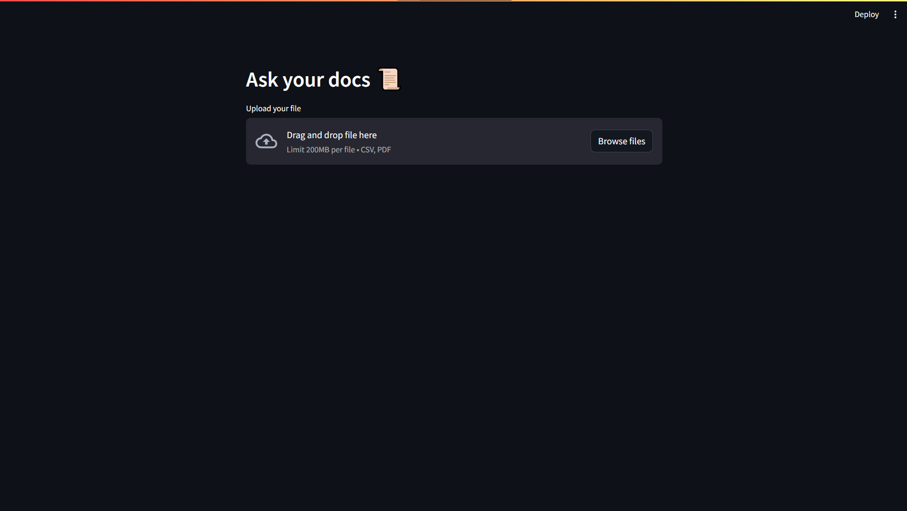
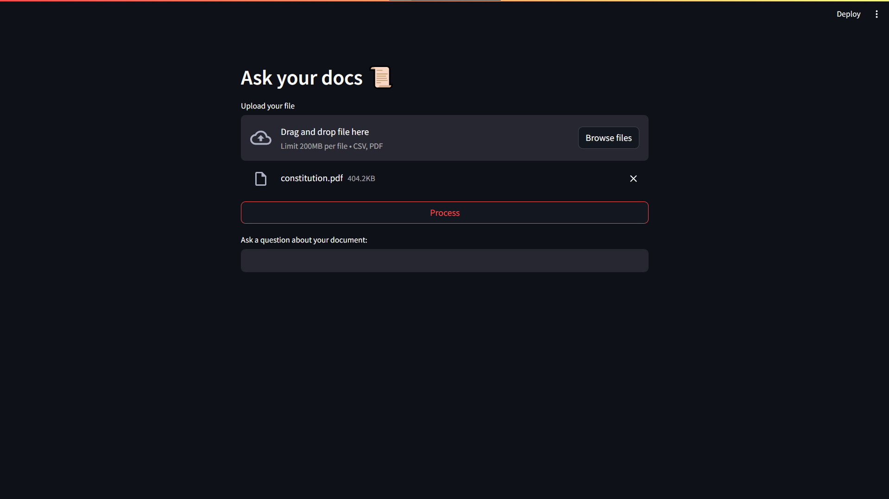
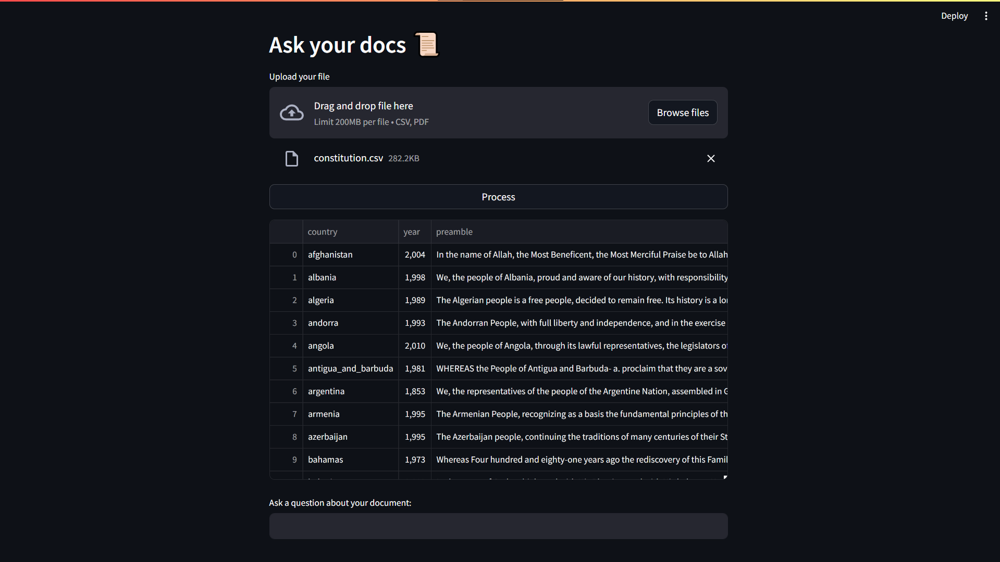

<h1 align="center">📜Docs-ai-chatbot</h1>

## Table of Contents

 - [First look](https://github.com/maciekmalachowski/Docs-ai-chatbot#first-look)
 - [Installation](https://github.com/maciekmalachowski/Docs-ai-chatbot#installation)
 - [Model](https://github.com/maciekmalachowski/Docs-ai-chatbot#model)
 - [App appearance](https://github.com/maciekmalachowski/Docs-ai-chatbot#app-appearance)

<br>
 
<h1 align="center" id="first-look"> First look 👀 </h1>

### An application written in `Python` allows us to chat with our *PDF* and *CSV* files. 
### By using the LLM `GPT4ALL` module from `Langchain`, we read data from the file. Then the chatbot uses the `Mistral 7B` model to return answers to the questions asked.
### The user interface is based on the open-source `Streamlit` library.

<br>

<h1 align="center" id="installation">Installation ℹ</h1>

- First of all, clone this repository on your device. Open your shell and paste the following commands:

*URL cloning*
```
git clone https://github.com/maciekmalachowski/Docs-ai-chatbot.git
```
*SSH cloning*
```
git clone git@github.com:maciekmalachowski/Docs-ai-chatbot.git
```
<br>

- Then you need to install the requirements contained in ``requirements.txt``.
```
pip install -r requirements.txt
```

<br>

- After that run `internal streamlit server` in the repository folder.
```
streamlit run main.py
```
Streamlit will launch the *main.py* file contained in the folder and *automatically* display it in the browser. 

<br>

<h1 align="center" id="model">Model 📂</h1>

#### Unfortunately, the model is too large to upload to this project, so you have to download it yourself. 
#### It is very simple. Just go to the [GPT4ALL](https://gpt4all.io/index.html) and choose the model that suits you best. 
#### In this project, I am using `mistral-7b-instruct-v0.1.Q4_0.gguf`.
#### Then place it in the `docs/model` folder.
<br>

<h1 align="center" id="app-appearance"> App appearance 🔍</h1>

#### The front page doesn't have much, but that was the idea - to make the application trivially easy to use.

<p align="center"></p>

#### After uploading the file and pressing the `Process` button, a window will appear where we can ask questions about the document.

<p align="center"></p>

#### Additionally, when you upload a *CSV* file, a table with data from that document will be displayed.

<p align="center"></p>

#### As the name of the project suggests, questions and answers are displayed in the form of a chat.

<p align="center"></p>

